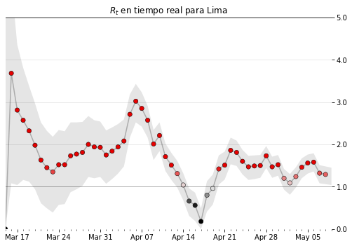

## El Martillazo y la danza
 
En este cuaderno se presenta el código necesario para definir el  para la región Lima, que es posible actualizar diariamente, gracias a los datos de **Jesus M. Castagnetto** que pueden bajar desde su [Github](https://github.com/jmcastagnetto/covid-19-peru-data).

El código es original de **Kevin Systrom**. Pueden encontrar extensas explicaciones en su [Git](https://github.com/k-sys/covid-19).

El modelo se basa en el historial de nuevos casos, El objetivo es lograr un valor menor a 1, que indica que para cada infectado exsistirá un contagiado. Obviamente un valor cercano a CERO nos indicará que ya no existen contagios y hemos contenido la epidemia localmente.
 
También pueden encontrar información sobre el tema en el artículo [El martillaso y el Huayno](https://medium.com/@rburhum/el-martillazo-y-el-huayno-278716f49938) de **Ragi Yaser Burhum Espinoza** o en la publicación original de Kevin Systrom en el siguiente [link](http://systrom.com/blog/the-metric-we-need-to-manage-covid-19/).
